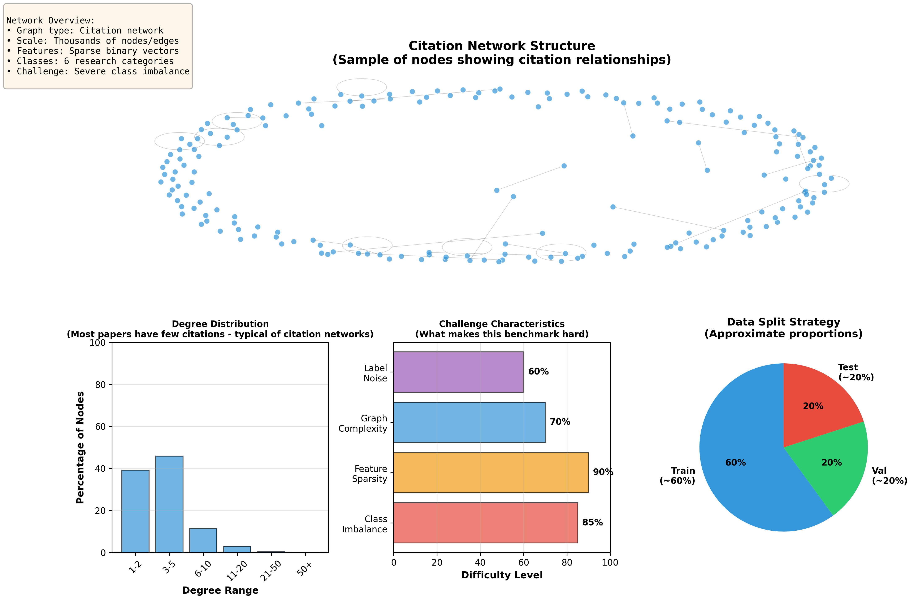

# 🎓 GNN-Challenge: Neural Citation Network

## 🎯 Challenge Overview

Welcome to the **Neural Citation Challenge**! This competition focuses on predicting the research topic of scientific papers using Graph Neural Networks (GNNs) on the **CiteSeer** citation network.

**[🏆 View Live Leaderboard](https://ignatiusbalayo.github.io/gnn-challenge/leaderboard.html)**

### Problem Description

The task is **Semi-Supervised Node Classification**. Given a citation network where nodes represent papers and edges represent citations, you must predict the **Research Topic (Class)** of papers in the test set.

**Classes (Research Topics):**
- **0 - AI**: Artificial Intelligence
- **1 - Agents**: Autonomous Agents
- **2 - DB**: Databases
- **3 - IR**: Information Retrieval
- **4 - ML**: Machine Learning
- **5 - HCI**: Human Computer Interaction

### What's Challenging?

1.  **Graph Structure**: Papers are not independent entities; they are linked by citations. A paper citing an "AI" paper is likely to be about "AI" itself. You must leverage this relational information.
2.  **Feature Sparsity**: The node features are sparse bag-of-words vectors (0/1 indicating word presence), making it hard for traditional dense models (like MLPs) to learn effectively.
3.  **Inductive vs Transductive**: While this setup is transductive (all nodes are present during training), you must ensure your model generalizes to the test nodes without "peeking" at their labels.
4.  **Imbalanced Classes**: Some topics (like 'DB' or 'AI') may have significantly more papers than others (like 'Agents'), requiring robust evaluation metrics.

---

## 📊 Dataset

The dataset is based on the canonical **CiteSeer Citation Network**:
- **Nodes**: 3,327 Scientific Papers
- **Edges**: 4,732 Citations (Undirected)
- **Features**: 3,703 Unique words (Bag-of-Words)
- **Classes**: 6 Categories

**Files available in `data/processed/` :**

#### 1. `features.csv`
Contains the raw content features for every paper.
| Column | Type | Description |
|---|---|---|
| `id` | int | Unique Paper ID |
| `0`...`3702` | int | Binary feature (1 = word present, 0 = absent) |

#### 2. `edges.csv`
Represents the citation graph structure.
| Column | Type | Description |
|---|---|---|
| `source` | int | ID of the citing paper |
| `target` | int | ID of the cited paper |

#### 3. `train_indices.csv` & `val_indices.csv`
Lists of Node IDs allocated for training and validation.
* **Train Set**: 50% of nodes (1,663 papers)
* **Val Set**: 20% of nodes (665 papers)
* **Test Set**: 30% of nodes (999 papers) - **HIDDEN LABELS**

### Graph Visualization

Below is a visualization of the CiteSeer network topology:


*Degree distribution of the CiteSeer network. Most papers have few citations, but some "hub" papers have many.*

---

## 🎯 Evaluation Metric

**Primary Metric: Macro-F1 Score**

Since class distribution can be imbalanced, simple accuracy is not enough. We use the **Macro-F1 Score**, which calculates the F1 score for each class independently and then takes the average. This ensures that performance on smaller classes (like 'Agents') is just as important as on larger classes.

**Thresholds:**
* **Passing Grade**: > 65% Accuracy (Baseline GCN)
* **Distinction**: > 75% Accuracy & > 0.70 Macro-F1 (Likely requires GAT or GraphSAGE)

---

## 📋 Constraints

To ensure a fair benchmark:

1.  **Fixed Splits**: You **must** use the provided `train_indices.csv` and `val_indices.csv`. Random splitting is not allowed.
2.  **No External Data**: You cannot use external text embeddings (like BERT) or metadata not provided in the repo.
3.  **CPU/GPU**: Models should be lightweight enough to train on a standard Colab instance (Training time < 10 mins).

---

## 🤝 How to Submit

### Submission Process

1.  **Fork this repository** to your GitHub account.

2.  **Install Dependencies**:
    ```bash
    pip install -r requirements.txt
    ```

3.  **Train your Model**:
    Use the starter code in `starter_code/` or write your own script.
    * Load graph from `edges.csv`.
    * Load features from `features.csv`.
    * Train **only** on IDs found in `train_indices.csv`.

4.  **Generate Predictions**:
    Create a CSV file for the **Test IDs** (found in `data/processed/test_indices.csv`).

    **Required Format:**
    ```csv
    id,pred_label
    302,1
    455,4
    ...
    ```

5.  **Score Locally (Optional)**:
    *Note: You don't have the test labels, so you can only score against your Validation set locally.*

6.  **Submit via Pull Request**:
    * Save your prediction file to: `submissions/my_submission.csv`
    * Commit and Push to your fork.
    * Open a **Pull Request** to the main repository.

    **🤖 The Auto-Grader will run instantly and post your score!**

---

## 🏆 Leaderboard

The leaderboard is automatically updated when a Pull Request passes the evaluation.

👉 **[View Live Leaderboard](https://ignatiusbalayo.github.io/gnn-challenge/leaderboard.html)**

| Rank | User | Accuracy | F1-Macro | Date |
|---|---|---|---|---|
| 1 | @Baseline-Bot | 68.00% | 0.6200 | 2026-01-12 |

---

## 📚 References

* **Dataset**: [CiteSeer (LINQS)](https://linqs.org/datasets/#citeseer)
* **GCN Paper**: [Semi-Supervised Classification with Graph Convolutional Networks (Kipf & Welling)](https://arxiv.org/abs/1609.02907)
* **GAT Paper**: [Graph Attention Networks (Velickovic et al.)](https://arxiv.org/abs/1710.10903)

## 📄 License

This project is licensed under the MIT License - see the [LICENSE](LICENSE) file for details.

**Good luck Have Fun! 🚀**